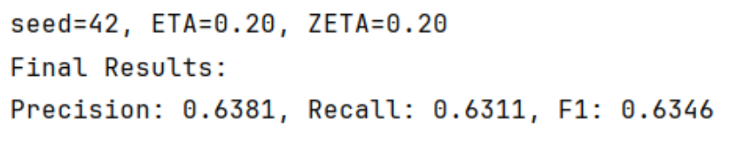
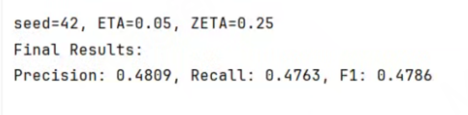
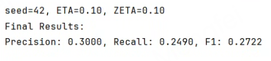
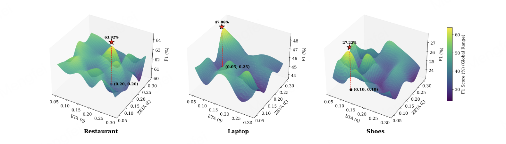

## Requirements

We recommend using the following environment:

- Python: 3.7
- PyTorch 1.11.0+cu113
- Transformers 4.12.0
- NumPy 1.21.6
- tqdm 4.67.1
- sentencepiece 0.2.0
- PyTorch Lightning: 1.3.5
- spacy==3.4.4
- en-core-web-sm==3.4.0

## Installation

We recommend creating a new conda environment first:

```bash
conda create -n msws python=3.7 -y
conda activate msws

pip install torch==1.11.0+cu113 torchvision==0.12.0+cu113 torchaudio==0.11.0+cu113 --extra-index-url https://download.pytorch.org/whl/cu113
pip install -r requirements.txt

MSWS/
├── README.md
├── requirements.txt
├── main.py
├── data_utils.py
├── eval_utils.py
├── data/
│   ├── restaurant-acos/
│   ├── laptop-acos/
│   └── shoes-acos/


## Hyperparameters

- Optimizer: AdamW
- Learning rate: 3e-5
- Epsilon: 1e-8
- Number of epochs: 30
- Gradient clipping: applied
- Multi-scale supervision:
  - Word window budget: Bw = 6
  - Phrase window budget: Bp = 4
- Weighting hyperparameter: λ = 0.5
- Clause candidate Top-K: 1 for short sentences, 3 for others
- Character 3-gram Jaccard threshold: 0.85
- Seeds used for 5-run average: 11, 15, 42, 47, 51

## Hyperparameter Search (η and ζ)

- η (phrase-view contribution) and ζ (word-view contribution) tested in range: [0.05, 0.30] with step size 0.05
- Default values used in experiments:
  - Restaurant: η = 0.20, ζ = 0.20
  - Laptop: η = 0.05, ζ = 0.25
  - Shoes: η = 0.10, ζ = 0.10
## Experimental Results

- Restaurant: η = 0.20, ζ = 0.20
- Laptop: η = 0.05, ζ = 0.25
- Shoes: η = 0.10, ζ = 0.10






